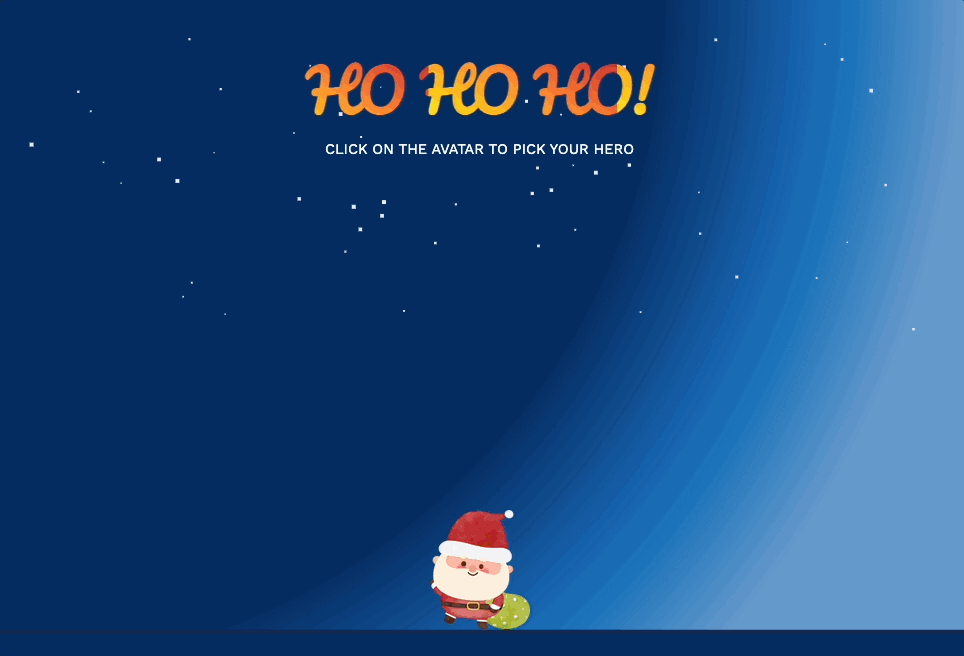

##  Animated Fireworks  by Ishan 

An interactive animated fireworks display built using **JavaScript, HTML, and CSS**. This project simulates fireworks explosions on the browser canvas with colorful effects and smooth animations.  

## Features  
- Realistic fireworks explosions with multiple colors and patterns  
- Smooth animation rendered using the HTML `<canvas>` element  
- Randomized launch positions and explosion effects for variety  

## Tech Stack

* **HTML** 
* **JavaScript** 
* **CSS** 
## Preview

##  Demo  
To run locally:  
    1. Clone this repository:  
   ```bash
   git clone https://github.com/Ish45883/Animated_Fireworks.git
````

2. Navigate into the project folder:

   ```bash
   cd Animated_Fireworks
   ```
3. Open `index.html` in your browser.

Enjoy the fireworks show! 


## Project Structure

```
Animated_Fireworks/
├── index.html      # Main entry point
├── style.css       # Styling for the canvas and page
├── script.js       # Fireworks animation logic
├── assets/         # Images and other assets
│   ├── santa.png
│   ├── reindeer.png
│   ├── bear.png
│   └── animation.gif
└── README.md   
```

##  Credits

This project was inspired by  [Codedex](https://www.codedex.io/projects/animate-fireworks-with-javascript-and-canvas).
This project was created with assistance from OpenAI.


